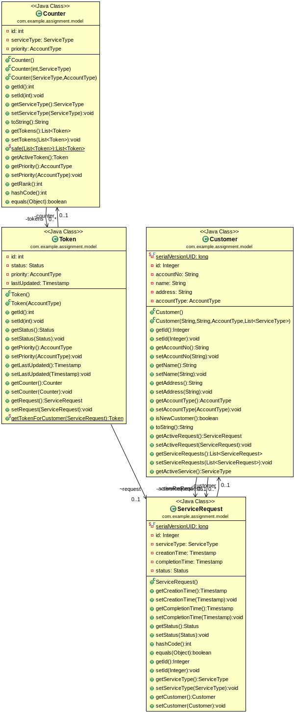

# token-generation-management-system

Problem: A simple location tracker application that would receive data from IOT devices or mobile on location of a given vehicle or person.

Tech Stack:

1.Java - 1.8
2.Spring Boot - 2.0.0
3.PostgreSql - 9.5.10

# Setup Instructions
Prerequisite:

1.Java 1.8 or higher installed

2.PostgreSql 9.5 or higher installed (https://www.postgresql.org/download/linux/ubuntu/)

3.active-spring.Maven installed (https://maven.apache.org/install.html)

Run Application:

mvn install && java -jar target/token-generation-management-0.0.1-SNAPSHOT.jar

# View Rest Api Documentation:
Swagger is integrated to the application. To view documentation, follow the below url after running the application http://localhost:8080/swagger-ui.html

# Assumption:
- Bank is having multiple branches with existing customers. Services offered by branch is availed at specific counters and PREMIUM account holders have special counters for each those services.
 

- Users having access to system at counters can access rest APIs for operating token at counters.

- Could have used any **asynchronous messaging queues like RabbitMQ** but since requirement was not getting fit like we needed to show list of tokens under each counter with Apis.

# Class Diagram:

# Rest API's:
/rest/api/banking

1.URL: **/counters**

Method : **GET** 

Response : List {Counter} Gets statuses of all counters available

- Gets statuses of all service counters available and the token information under each counter. This provides info to customer who is awaiting for their token turn to come as per the service he requested.

Assumption: Counters are available to service customer's requests if token is processed for the same and counter app is capable of triggering rest request.

2.URL : **/counters/type** 

Method : **GET** 

Response : List {Counter} Gets statuses of all counters available for particular service provided as parameter.

- Gets statuses of all counters available for particular service and the token information under each counter. This provides info to customer who is awaiting for their token turn to come as per the service he requested.

Assumption: Counters are available to service customer's requests if token is processed for the same and counter app is capable of triggering rest request.

3.URL: **/token**

Method : **POST** 

Request Body : 

{ 

	"id":66436,
	"accountNo":"123456789102",
	"name":"John Doe",
	"address":"Panjagutta",
	"accountType":"PREMIUM",
	"activeRequest":null,
	"serviceRequests":
	[
		{
			"id":null,
			"serviceType":"DEPOSIT",
			"creationTime":1518317923870,
			"completionTime":null,
			"status":"IN_PROGRESS"
		}
	],
	"activeService":null,
	"newCustomer":false

} 

- This is to create token for each customer for each service requested as per his priority. If he is new user then his basic details will be saved first to make him account holder, else token will be generated for existing customer.

If customer has multiple service requests, once service gets completed it automatically go for token generation for next request in the queue.

4.URL: **/counters/{id}**

Method : **GET** 

Response: Info regarding counter along with service it offers and list of tokens to be processed.

5.URL : **/counters/{id}/operate**

Method : **PUT** 

- Used by counter operator to operate services for each customer on token basis based on priority.

Assumption: Counters are available to service customer's requests if token is processed for the same and counter app is capable of triggering rest request.

 
